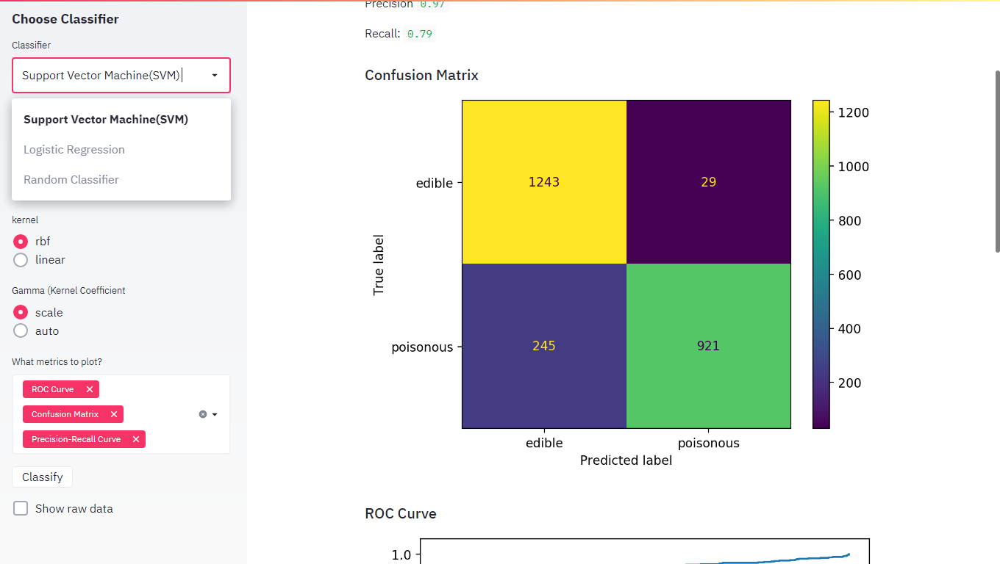

# *Web App Classifiers Streamlit & Python* 


### Available Machine learning Algorithms
- [x] Support Vector Machine
- [x] Logistic Regression
- [x] Random Forest Classifier 
- [ ] KNN -On task
- [ ] Decision Tree -On task
- [ ] Naive Bayes -On task

### Available Metrics
- [x] Confusion Matrix
- [x] Accuracy
- [x] Precision
- [x] Recall
- [x] AUC ROC
- [x] ROC Curve
- [x] Precision Recall Curve
- [ ] Validation Curve -On task
- [ ] Learning Curve -On task

### Set up guide
> First Get the repository files Downloading or Clonning the repository
> Now open the folder using any ide or editor and select python. Now navigate to console and type
```bash
streamlit run app.py
```
> It will open in localhost server. Now you can use it easily.

### Customize Heading and Title of your Task
```python
def main():
    st.title('Binary Classification Web App')
    st.sidebar.title('Binary Classifier App')
    st.markdown("Are Your Mashroom poisonous?")
    st.sidebar.markdown("Are Your Mashroom poisonous?")

    @st.cache(persist = True)
    def load_data():
        df = pd.read_csv('data/mushrooms.csv')
        le = LabelEncoder()

        for col in df.columns:
            df[col] = le.fit_transform(df[col])

        return df
```
Change the title,sidebar title,markdown and sidebar markdown according to your project.

### Environment 
Make sure you have all necessery python library installed. For this projects you need 
* Numpy
* Pandas
* Streamlit
* Scikit-learn
  
if you don't have these libraries go to python or anaconda prompt and paste these:
```bash
pip install numpy
pip install pandas
pip install streamlit
pip install sklearn
```


### Get touch with Me
Connect- [Linkedin](https://linkedin.com/in/rakibhhridoy)
Website- [RakibHHridoy](https://rakibhhridoy.github.io)


